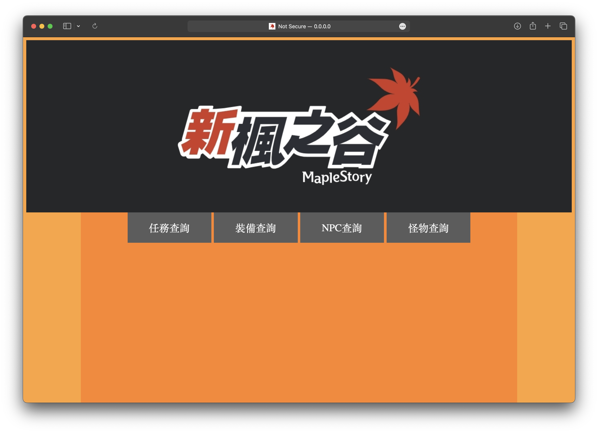
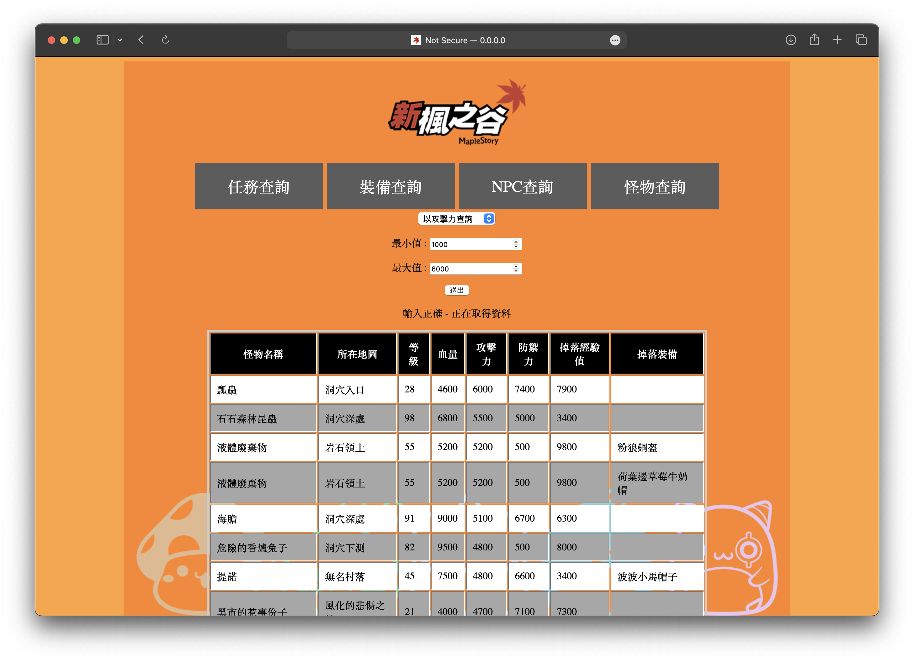

# 楓之谷遊戲資訊查詢網站

## 介紹

- 提供給楓之谷玩家查詢的資訊網站
- 透過SQL讓玩家可以查詢想要的資訊
- 多達二十種查詢方式

## 查詢方式

### 1. 查詢 NPC

- NPC名查詢
- 所在地點查詢
- 取得裝備查詢

### 2. 查詢 裝備

- 裝備名稱查詢
- 獲得NPC查詢
- 掉落怪物查詢
- 攻擊力查詢
- 玩家需求等級查詢

### 3. 查詢 怪物

- 怪物名稱查詢
- 所在地點查詢
- 等級查詢
- 血量查詢
- 攻擊力查詢
- 防禦力查詢
- 掉落經驗查詢
- 掉落裝備查詢

### 4. 查詢 任務

- 任務、前置任務名稱查詢
- 關聯NPC查詢
- 討伐怪物查詢
- 獲得總經驗值量查詢

                  首頁

                  查詢頁面

## 技術

### 前端

Html、CSS、JavaScript、JQuery

### 後端

Fastapi

### 資料庫

SQLite

## 貢獻

- [楊世宇](https://github.com/Edmond-Yang)
- [林庭毅](https://github.com/TingYeeet)
- [陳建維](https://github.com/TamakiSilSha)
- [林于喬](https://github.com/nrnmnrn)